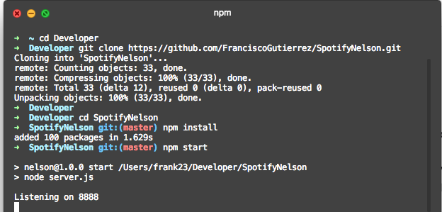

# SpotifyNelson
A spotify interface for recommendations based on Nelson's UI: https://goo.gl/Kmc9TY - https://nelson.glitch.me/#

## Instructions: 

Open your terminal and navigate to the desired place to clone this repository, then:

```bash
# Install all the dependencies
npm install

# Then start the app
npm start
```



Go to spotify's developer dashboard to get your client ID and set your redirect URIs, then replace in the client.js file as shown in this picture:


Happy hacking!


